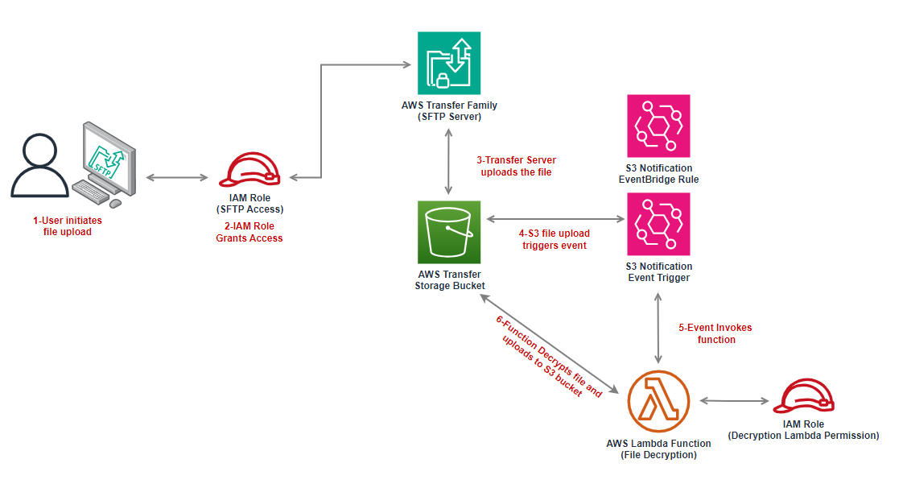

# Automated File Transfer and Decryption Process Using AWS

## **Overview**
This project automates file transfers and decryption using **AWS Transfer Family, AWS Lambda, and Amazon EventBridge**. When a file is uploaded to an **SFTP server**, an **EventBridge rule** triggers a **Lambda function** to decrypt the file and store the processed data in an **S3 bucket**.

The infrastructure is provisioned using **AWS CloudFormation**, ensuring automation and scalability.

---

## **Architecture**
The solution consists of the following AWS components:

- **AWS Transfer Family** – Provides a managed SFTP server for secure file transfers.
- **Amazon S3** – Stores the uploaded and decrypted files.
- **AWS Lambda** – Handles file decryption upon upload.
- **Amazon EventBridge** – Monitors S3 bucket events and triggers the Lambda function.
- **IAM Roles & Policies** – Grants necessary permissions for each service to function securely.

### **Architecture Diagram**


---

## **Deployment Instructions**
### **Prerequisites**
Before deploying, ensure you have:
- An **AWS account** with necessary permissions.
- An existing **S3 bucket** for storing files.
- **AWS CLI** installed and configured with appropriate credentials.

**Note:** These instructions are for deployment on **Windows OS** using **VSCode** with **WSL** installed.

### **Deploy the CloudFormation Stack**
#### **1. Clone the Repository**
```bash
git clone https://github.com/samcolon/aws-file-transfer.git
cd aws-file-transfer
```

#### **2. Deploy the CloudFormation Stack**
- Replace `<BUCKETNAME>` with an **existing S3 bucket**.
- Replace `<DESIREDUSERNAME>` with your chosen **TransferUserName**.

```bash
aws cloudformation deploy \
  --template-file AWSTransferFamily.yaml \
  --stack-name aws-transfer-lambda-stack \
  --capabilities CAPABILITY_NAMED_IAM \
  --parameter-overrides \
    BucketName=<BUCKETNAME> \
    TransferUserName=<DESIREDUSERNAME>
```

#### **3. Retrieve the Stack Outputs**
```bash
aws cloudformation describe-stacks --stack-name aws-transfer-lambda-stack
```
- **Note:** Take note of the **Transfer Server ID** and **Endpoint**, as these are required for setup.

---

## **Configuring the Transfer User**
### **1. Generate SSH Keys**
Using the **Linux CLI** or **WSL**, run:
```bash
ssh-keygen -t rsa -b 4096 -C "<TransferUserName>"
```
- Save the key in the default location by pressing **Enter** (`~/.ssh/id_rsa`).
- Do **not** enter a passphrase.

### **2. Import the SSH Key into AWS Transfer Family**
#### **Extract the SSH Public Key:**
```bash
cat ~/.ssh/id_rsa.pub
```
#### **Import the Key via AWS CLI:**
```bash
aws transfer import-ssh-public-key \
  --server-id <PasteTransferServerIDhere> \
  --user-name <TransferUserName> \
  --ssh-public-key-body "<PasteSSHKeyHere>"
```
#### **3. Verify SSH Key Import**
```bash
aws transfer describe-user --server-id <TransferServerID> --user-name <TransferUserName>
```

### **4. Connect Using SFTP**
```bash
sftp -i ~/.ssh/id_rsa <TransferUserName>@<TransferServerEndpoint>
```
- The **default port** for SFTP is **22**.
- If the connection fails, verify that:
  - The **public SSH key** was imported correctly.
  - The **IAM permissions** allow access to the Transfer Server.
  - The **Transfer Server is active** in AWS Transfer Family.

---

## **Testing the Setup**
#### **1. Upload a File via SFTP**
```sftp
put "C:/path/to/file"
```
- Verify the file upload using:
```sftp
ls
```
- A **decrypted folder** should be created inside the SFTP directory, containing the decrypted file.

#### **2. Exit the SFTP CLI**
```sftp
exit
```

#### **3. Generate a Presigned URL for Decrypted File**
```bash
aws s3 presign s3://<BUCKETNAME>/path/to/yourfile.txt --expires-in 600
```
- This URL will be **valid for 10 minutes**.

---

## **Cleanup**
### **1. Delete the CloudFormation Stack**
```bash
aws cloudformation delete-stack --stack-name aws-transfer-lambda-stack
```

### **2. Delete S3 Objects and Bucket**
#### **Empty the S3 Bucket**
```bash
aws s3 rm s3://<BUCKETNAME> --recursive
```
#### **Delete the S3 Bucket**
```bash
aws s3 rb s3://<BUCKETNAME> --force
```

---

## **Additional Information**
- **Previously**, deployment required manually creating the **S3 bucket** and **uploading the Lambda function** before executing the template.
- The Lambda function is now **embedded inline** in the CloudFormation template for a more automated deployment.

---

## **Future Enhancements**
If given more time, I would:
1. **Implement AWS Key Management Service (KMS)** – To rotate SSH keys automatically.
2. **Store SSH keys securely in an S3 bucket** – To enable easier key management.
3. **Set up Amazon SNS notifications** – To alert users when their SSH keys are about to expire and when new keys are ready for download.

---
